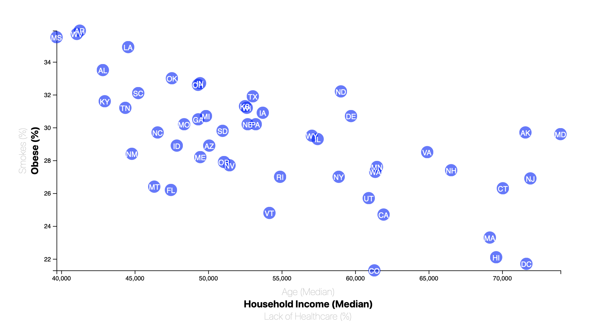

# demographic visualizations with d3

Simple visualization of obesity and smoking rates in the United States compared to community demographic information from the 
US Census American Community Survey from 2014.

Deployed at: https://jackrapp.github.io/d3_census_visualization/

